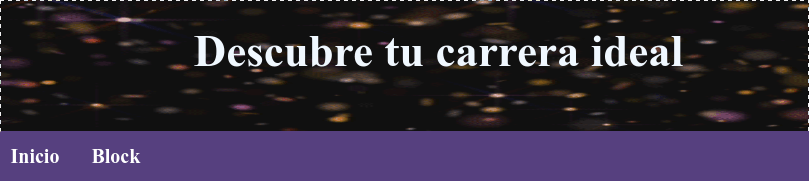
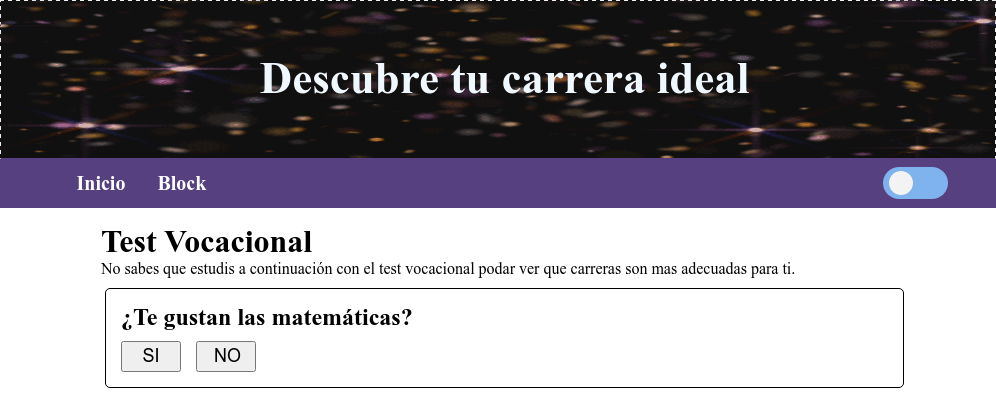
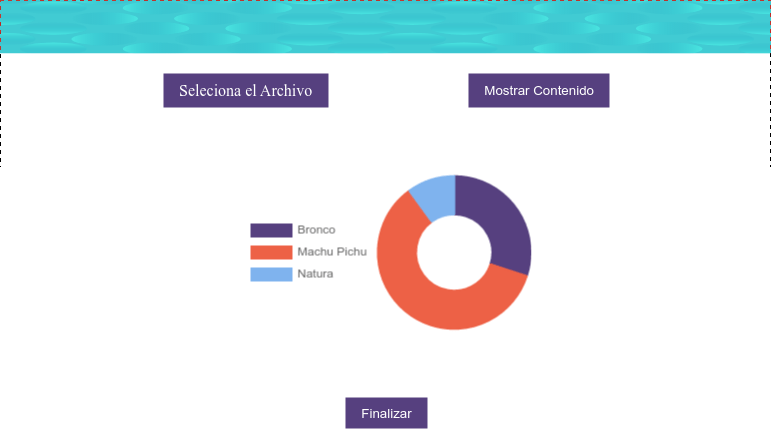

# Test Vocacional
Se estara realizando el dise&#241;o para una pagina web para un test vocacional que se estara usando los lenguages de programaci&#243;n _**HTML, CSS y JavaScript**_. En las siguientes verciones que se a&#241;adier&#243;n o se eliminaron ciertos elementos en la paguina pero se anunciaran a continuaci&#243;n que se realizo en cada verci&#243;n.

---
### Pagina ya en funcionamiento [ir a la pagina](https://ninjadiaz007.github.io/Blog/ProyectoIA/index.html)
---

## Verción 1.0
En la versión 1.0, aquí están los cambios notables:
- Agregamos un atractivo gif como imagen hero.
- Iniciamos el diseño del menú de navegación (aún en proceso).



## Verci&#243;n 1.1
En la versión 1.1, se hizo algunos ajustes para mejorar la presentación y usabilidad:

- Estilizamos el formato de las preguntas para una apariencia más atractiva.
- Introdujimos un botón para habilitar el modo oscuro.



## Verci&#243;n 1.2
En la versión 1.2, continuamos mejorando la experiencia del usuario:

- Ahora mostramos las preguntas a través de un arreglo, simplificando la administración de contenido.
- Estamos en proceso de estilizar los botones de "Siguiente" y "Anterior" para una navegación más fluida.
- Estamos trabajando en la incorporación de un nuevo botón para guardar tus respuestas.

Además, aquí tienes una vista previa del código que utilizamos para mostrar las preguntas en la pantalla:

```js
function PreguntasPantalla(){
    let i;
    let texto = document.querySelectorAll(".txt");
    
    for(i = 0; i <= preguntas.length; i++){
        texto[i].innerHTML = preguntas[i];
        //console.log(`Pregunta: ${preguntas[i]}`);
    }
}
PreguntasPantalla();
```

# Verci&#243;n 2.0
En la versión 2.0, se a dado un gran paso en la evolución del test vocacional:

- Introdujimos un carrusel para mostrar las preguntas en bloques de 10, mejorando la navegación. 
- Implementamos funcionalidad a los botones de "Siguiente" y "Anterior" para facilitar la exploración de las preguntas.

# Verci&#243;n 2.1
En la versión 2.1, continuamos optimizando la experiencia del usuario:

- Actualizo el código para generar documentos, lo que permitirá guardar tus resultados.
- El menú de navegación está ahora completamente funcional.
- También hemos habilitado el botón para guardar tus respuestas.

# Vercion 2.2
En la versión 2.2, se alcanzo un hito importante:

- El botón para guardar el contenido de las preguntas ahora está completamente funcional, lo que te permitirá guardar tus resultados de manera sencilla.

# Verci&#243;n 3.0
En la última iteración, la verci&#243;n 3.0, se realizaron incorporaciones significativas para mejorar la presentación de los resultados:
- Se añadió una gráfica separada para visualizar los resultados.

# Verci&#243;n 3.1
En la versión 3.1, se implementaron cambios clave en la visualización de la gráfica utilizando la biblioteca Chart.js. Aquí está el código que utilizamos para mostrar los datos:

```js
// Codigo de ejemplo para mostrar datos en la grafica
const printCharts = ()=>{
    rendeModelsChart();
}

const rendeModelsChart = ()=>{
    const data = {
        labels: ["azul", "dos", "tres"],
        datasets: [{
            data: [30,50,20],
            borderColor: ["#56407F", "#ED6146", "#7FB3EE"],
            backgroundColor: ["#56407F", "#ED6146", "#7FB3EE"]
        }] 
    }

    const options = {
    	plugins: {
    		legend: {position: "left"}
    	}
    }
    new Chart('graphi', {type: 'doughnut', data, options})
}
printCharts();
``` 
Además, se introdujeron nuevas funcionalidades para facilitar la gestión de datos:

- Se añadió un botón para buscar y cargar el archivo generado por la inteligencia artificial (IA) con los resultados finales.
- Se incorporó un botón para cargar datos y mostrarlos en la gráfica.
- Se incluyó un botón de actualización de página para manejar eficientemente la visualización de datos con la gráfica.



# Verci&#243;n 3.2
En la versión 3.2, se implementaron mejoras adicionales y características nuevas:

- Se añadió una función de ayuda en forma de pop-up (modal o pantalla emergente) para guiar a los usuarios.
- Se colocó un enlace al blog de la institución en la interfaz.
- Se introdujo un footer (pie de página) que incluye información y enlaces a las redes sociales de la institución.
- Se enlazaron correctamente los perfiles de redes sociales y la página oficial de la institución.
- Se actualizó el botón del switch para guardar el modo oscuro en el almacenamiento local, asegurando que el estado actual se conserve al recargar la página.

---
### Pagina ya en funcionamiento [ir a la pagina](https://ninjadiaz007.github.io/Blog/ProyectoIA/index.html)
---
